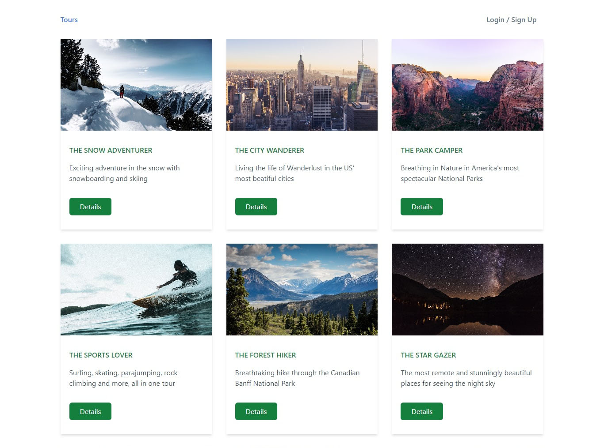

# Kenyan Tours App - MERN Stack

## Welcome! 👋

This is a Kenyan Tours App. It features some of the best tourist destinations in Kenya. These packages are curated for a great touring experiene in Kenya.

## How it works

It is a simple fullstack app that captures the CRUD operations and database hosted at MongoDB.

## Technologies Used

1. React
2. TypeScript
3. NodeJS, Express
4. MongoDB
5. Tailwind CSS

## Live link to the Tours App

[https://eric-tours-app.vercel.app/](https://eric-tours-app.vercel.app 'Kenyan Tours App')
